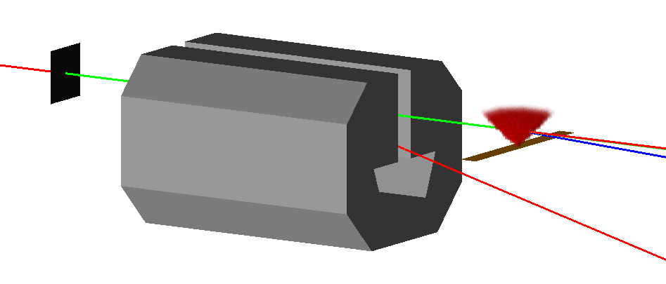

# Geant4 Photon Processes

This package contains a set of processes involving photons (Breit-Wheeler, 
elastic photon-photon scattering, Compton-scattering) allowing photon 
collision experiments to be modelled within the Geant4 framework.

## Installing

Before installing the package, make sure you have the following libraries 
installed:
* Geant4 (required, tested with v11.1.1)
* HDF5 (required)
* CMake (required)
* Eigen3 (required)
* libgp https://github.com/mblum/libgp (optional)

Once the dependencies are installed, start by downloading the package
```bash
git clone https://github.com/robbiewatt1/Photon-Processes
```
Now create a build directory for the package (this should be outside the 
package source directory) and configure the build with cmake:
```bash
mkdir PhotonProcess_Build
cd PhotonProcess_Build
cmake ../Photon-Processes/ -DBUILD_GP=ON -DCMAKE_INSTALL_PREFIX=<Install-location>
```
-DBUILD_GP=ON is optional, allowing a Gaussian process to be used to speed 
up the interaction probability calculation.  Next,  compile and install the 
package:
```bash
make install -j
```
Finally, run the following bash script to make sure the cross-section data 
tables can be found:
```bash
. <Install-location>/bin/Photon-Process.sh
```

## Using the package
All the processes in the package inherit from the base class 
G4VDiscreteProcess. Therefore, they can be added to the physics list in the 
standard way. The following is an example of how to add the Breit-Wheeler 
process, with a black body radiation field: